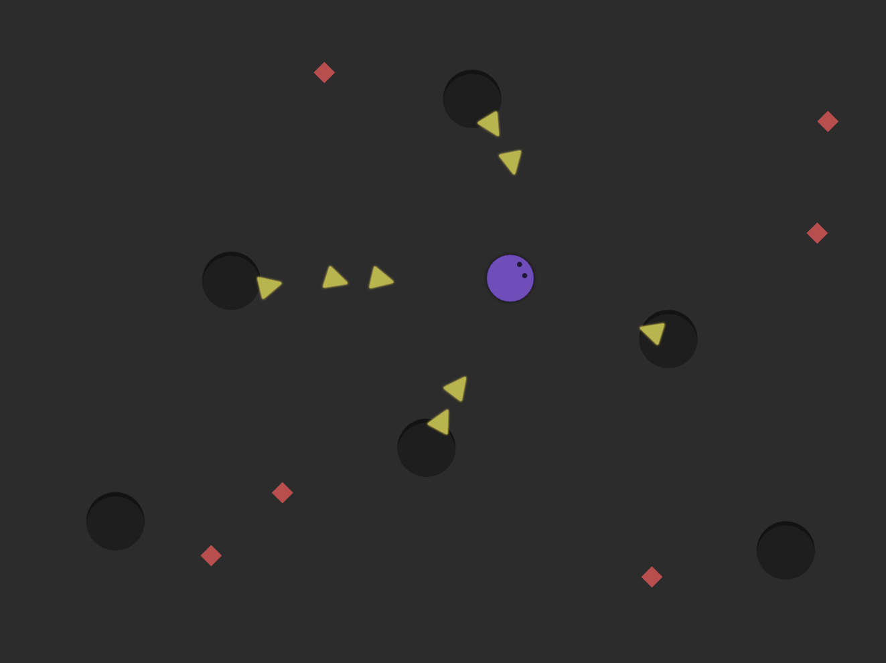

# Introducción al desarrollo de videojuegos

## Minion1

 - Gameloop
 - Motores de juegos comos imulación.
 - Motores de videojuegos.Tipos y diferencias.
 - Realizar un primer proyecto de introducción a videojuegos
 
### METAS

 - Primer acercamiento al engine Godot.
 - Desarrollar un juego sencillo con una lógica predeterminada.
 

### Reglas

- El círculo sigue al puntero del mouse, no es 1 a 1 con la posición del puntero sino que avanza hacia el puntero con cierta velocidad.
- Los triángulos aparecen en los agujeros, los triángulos persiguen al circulo. Tienen un tiempo de vida finito. Hay una cantidad máxima de triángulos en juego. Los triángulos tienen inercia.
 - El círculo colecciona los rombitos rojos al tocarlos.
 - Debe mostrarse en pantalla un contador de rombitos recolectados (un texto con la cantidad en números, no importa el estilo del texto).
 - Hay un contador de rombos rojos recolectados.
 - Los triangulos rompen el círculo si lo tocan. El juego se reinicia cuando esto ocurre.
 - Al presionar la barra espaciadora, el personaje hace un "dash" hacia la dirección en la que apunte en ese momento. Donde dash significa, en este caso, aumentar su velocidad x3 durante 0.4 segundos, pero pierde la capacidad de cambiar de dirección por ese tiempo.

Bonus:
 - Al perder una partida, no se resetea el juego instantáneamente, sino que se espera unos segundos con una pantalla de game over, y se le da la opción de volver a intentarlo con un botón.
 - Cada vez que se reinicia el juego, los agujeros aparecen en diferentes lugares.
 - Aparecen nuevos rombos cada X tiempo.
